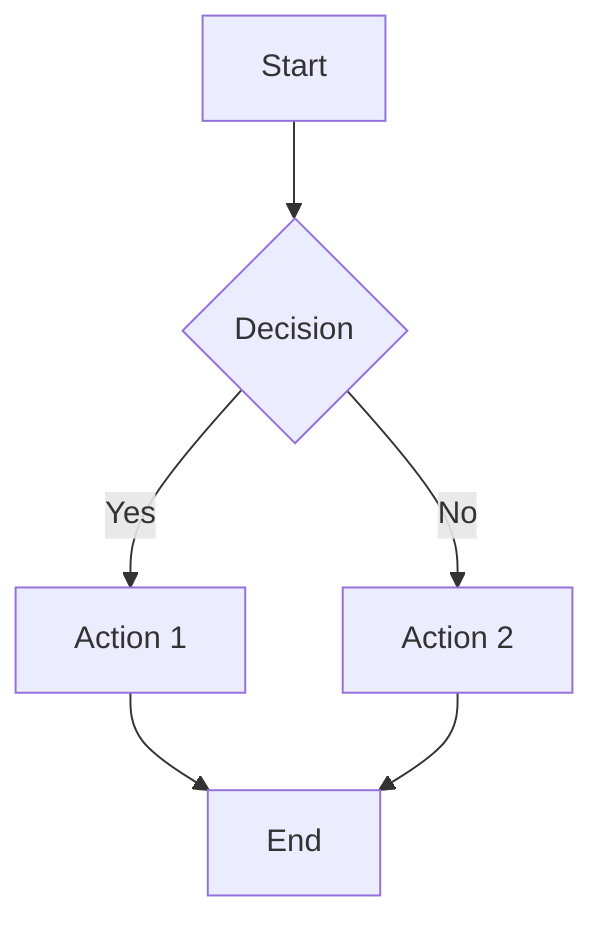
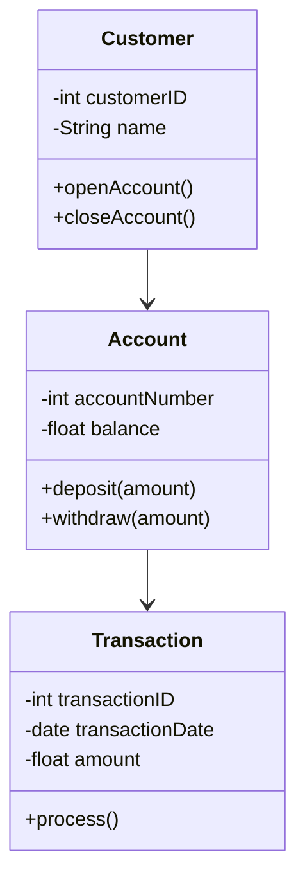

# AI-Powered Diagram Generation Tool

This AI-powered tool utilizes visual learning to simplify complex computer science concepts by generating various diagrams using the Mermaid diagramming language. By converting natural language descriptions into visual representations, this tool enhances the accessibility and retention of technical content.

## Table of Contents

1. [Introduction](#introduction)
2. [Supported Diagram Types](#supported-diagram-types)
   - [Flowcharts](#flowcharts)
   - [Sequence Diagrams](#sequence-diagrams)
   - [Mind Maps](#mind-maps)
   - [Class Diagrams](#class-diagrams)
   - [ER Diagrams](#er-diagrams)
   - [Gantt Charts](#gantt-charts)
   - [State Diagrams](#state-diagrams)
3. [Mermaid Diagramming Language](#mermaid-diagramming-language)
   - [Overview of Mermaid Syntax](#overview-of-mermaid-syntax)
   - [Integration with AI Tools](#integration-with-ai-tools)
4. [Building the AI Tool](#building-the-ai-tool)
   - [Prompt Engineering](#prompt-engineering)
   - [Few-Shot Learning](#few-shot-learning)
5. [The LLaMA3-70B Model](#the-llama3-70b-model)
   - [Architecture and Design](#architecture-and-design)
   - [Training and Capabilities](#training-and-capabilities)
   - [Langchain Library](#langchain-library)
   - [Integration with Groq API](#integration-with-groq-api)

## Introduction

Visual learning is a method that uses visual aids to facilitate understanding and retention of information. In the context of computer science and programming, visualizations such as diagrams and charts can simplify complex concepts, making them more accessible and easier to grasp. This chapter introduces an AI tool designed to explain computer science concepts and generate various diagrams using the Mermaid diagramming language.

## Supported Diagram Types

The AI tool supports the generation of several types of diagrams, each serving unique purposes in the context of computer science and programming:

### Flowcharts

Flowcharts are used to represent algorithms and workflows. They help in understanding the sequence of steps in a process.

**Example of a Flowchart**


### Sequence Diagrams

Sequence diagrams illustrate how objects interact in a particular sequence of time. They are useful for understanding the flow of messages between objects in a system.

**Example of a Sequence Diagram**


### Mind Maps

Mind maps are used to visually organize information. They are particularly useful for brainstorming and structuring complex concepts.

**Example of a Mind Map**


### Class Diagrams

Class diagrams represent the static structure of a system by showing its classes, attributes, methods, and relationships among objects.

**Example of a Class Diagram**


### ER Diagrams

Entity-Relationship (ER) diagrams are used to model the data structure of a database. They illustrate the relationships between entities in a database.

**Example of a simple ER Diagram**


### Gantt Charts

Gantt charts are used for project management, showing the timeline of tasks and their dependencies.

**Example of a simple Gantt Diagram**


### State Diagrams

State diagrams represent the states and transitions of a system, particularly useful in modeling the behavior of objects.


## Mermaid Diagramming Language

Mermaid is a powerful diagramming language that allows users to create various types of diagrams and visualizations using a simple and intuitive syntax. It is widely used in documentation, educational materials, and project management tools to create clear and informative visual representations.

### Overview of Mermaid Syntax

Mermaid uses a text-based syntax to define diagrams. Users can create diagrams by writing code in a plain text format, which is then rendered into graphical representations by the Mermaid parser. The simplicity and readability of Mermaid syntax make it accessible to both technical and non-technical users.

**Example of Mermaid Syntax for a Flowchart**



### Integration with AI Tools

Mermaid’s text-based syntax makes it an ideal candidate for integration with AI tools. In our project, the AI tool generates Mermaid code based on natural language descriptions provided by the user. This code is then rendered into diagrams, providing a visual representation of the requested concept. 

By leveraging the power of the LLaMA3-70B model and the simplicity of Mermaid syntax, our AI tool can generate detailed and accurate diagrams that enhance the understanding of complex computer science concepts.

## Building the AI Tool

The AI tool leverages advanced techniques in prompt engineering and few-shot learning to generate accurate explanations and diagrams from natural language inputs.

### Prompt Engineering

Prompt engineering is the process of designing and refining the prompts given to the AI model to elicit the desired responses. This involves crafting instructions and examples that guide the model to produce accurate and relevant outputs. In our tool, we use the LLaMA3-70B model and provide it with a system message that instructs it to act as an expert in generating Mermaid diagrams from natural language descriptions.

**System Message Example**

```
"You are an expert in generating Mermaid diagrams from natural language descriptions. Given a description of a computer science concept or a request for a specific type of diagram, generate the appropriate Mermaid code and a brief explanation."
```

### Few-Shot Learning

To refine the tool’s performance, the system message is supplemented with example inputs and outputs. These examples demonstrate how to translate user requests into Mermaid diagrams and explanations. This technique is known as few-shot learning.

Few-shot learning is a training approach where the model is provided with only a few examples to learn from. Unlike traditional machine learning models that require large datasets, few-shot learning leverages a limited number of examples to understand the task at hand. This approach is particularly useful for our tool because it allows the model to quickly adapt to generating various types of diagrams from diverse natural language inputs.

In the context of our tool, few-shot learning is implemented by providing the model with a small set of input-output pairs. Each pair consists of a user request and the corresponding Mermaid diagram code and explanation. 

**Example Input and Output for Few-Shot Learning**

**Input:** 
"Generate a class diagram for a simple banking system with classes for Account, Customer, and Transaction."

**Output:** 
"Here is a class diagram for a simple banking system:

By learning from these examples, the AI model can generalize and generate accurate diagrams for a wide range of requests.

## The LLaMA3-70B Model
* The LLaMA3-70B model is a state-of-the-art large language model developed by Meta AI. It is part of the LLaMA (Large Language Model Meta AI) series, which focuses on creating powerful, efficient, and versatile AI models for various applications. LLaMA3-70B, with 70 billion parameters, represents one of the largest and most capable models in the series.

* The LLaMA3-70B model is based on the transformer architecture, which has become the standard for modern natural language processing (NLP) models. Transformers use self-attention mechanisms to process input data in parallel, allowing for faster and more efficient handling of large datasets. The model consists of multiple layers of attention and feed-forward networks, enabling it to learn and generate complex patterns in the data.

* LLaMA3-70B was trained on a diverse and extensive dataset, covering a wide range of topics and languages. This comprehensive training enables the model to understand and generate human-like text across various domains. The model’s large size, with 70 billion parameters, allows it to capture intricate details and nuances in language, making it highly effective for tasks such as text generation, translation, summarization, and question-answering.

## Langchain Library

The Langchain library is a powerful tool in the development of applications that interact with large language models (LLMs). It provides a framework for integrating LLMs into various workflows, allowing developers to leverage the capabilities of these models effectively. In our AI tool, Langchain is used to implement the prompt engineering concepts and to manage the interaction between the AI model and the diagram generation process.

### Integration with Groq API

The Groq API is known for its fast AI inference, making it an ideal choice for real-time applications. The Langchain Groq library integrates Langchain with the Groq API, enabling efficient processing of user requests and generation of Mermaid diagrams.

## Deployment

The model is deployed as an API using **FastAPI** and containerized with **Docker** for platform-independent consistency. It is then hosted on **Hugging Face Spaces** to provide an accessible interface.

### FastAPI Implementation

**FastAPI** was chosen for its simplicity, high performance, and automatic documentation generation. Steps to implement FastAPI include:
1. **Setup**: Install FastAPI and Uvicorn.
2. **Define the API**: Create endpoints for recommendation functionality.
3. **Integrate Recommendation Logic**: Embed the recommendation function within the API endpoint.
4. **Run the API**: Use Uvicorn to launch the FastAPI application.

### Containerization with Docker

To ensure a consistent environment across different platforms, the API is containerized using **Docker**:
1. **Dockerfile**: Define the image.
2. **Build the Image**: Build the Docker image from the Dockerfile.
3. **Run the Container**: Start a container from the built image.

### Hosting on Hugging Face Spaces

The containerized API is hosted on **Hugging Face Spaces** for public accessibility:
1. **Create a Space**: Set up a new Space on Hugging Face.
2. **Configure Space**: Select Docker as the environment.
3. **Upload Docker Image**: Push the Docker image to the Hugging Face Space.
4. **Run the Space**: Start the Space to make the API accessible online.
